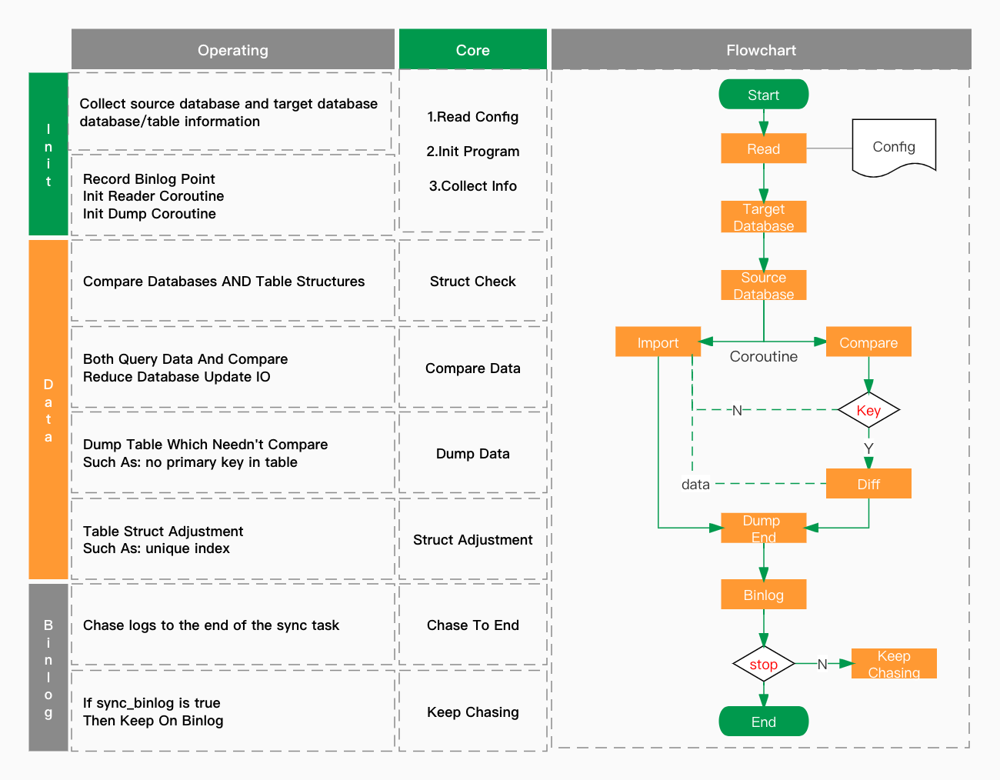

[中文简介](README_zh.md)

# Introduction

Sync 100% data of the multi-source database to target database.

DTS supports structure migration, full data comparison synchronization and incremental tracking.

By configuring the filter schema/table, which needn't sync to the target database.



## How it works

```
dts reader --config=task.yaml
```

## Config example

> task.yaml
```yaml
# metrics
stat_addr: "127.0.0.1:12800"

# record the sync process
use_storage: false
# enable binlog chasing
sync_binlog: true

# speed config
singleRowNums: 2500
readerNums: 10
writerNums: 10

# input resource
inputs:
  - driver: mysql
    name: input-first
    charset: "utf8"
    address: "127.0.0.1:3307"
    user: "root"
    password: "password"
    maxConnNums: 5
# output resource
output:
  driver: mysql
  name: output-test
  charset: "utf8"
  address: "127.0.0.1:3309"
  user: "root"
  password: "password"
  maxConnNums: 10

# filters config
filters:
#  database.table:
#    column: md5
#  test.user:
#    phone: Mobile
```

#### Need Attention

```
`binglog` Enable
`binlog_format` Value `row`
`binlog_row_image` Value `full`
```