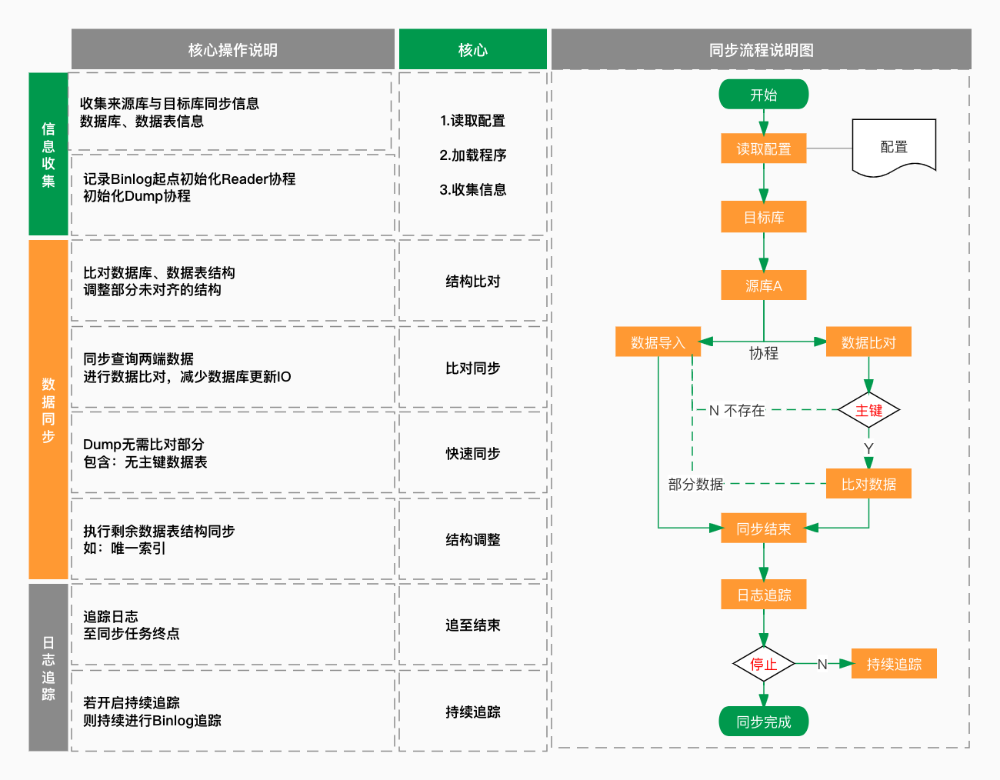

[English](README.md)

# 介绍

将多源数据库的数据100%同步到目标数据库。

DTS支持结构迁移、全数据对比同步和增量跟踪。

通过配置过滤器模式/表，不需要同步到目标数据库。



## 如何使用

```
dts reader --config=task.yaml
```

## 配置文件样例

> task.yaml
```yaml
# 开启指标监听地址
stat_addr: "127.0.0.1:12800"

# 是否记录同步进程
use_storage: false
# 是否开启binlog持续追踪
sync_binlog: true

# 速度配置，单次读取数据量
singleRowNums: 2500
readerNums: 10
writerNums: 10

# 数据来源
inputs:
  - driver: mysql
    name: input-first
    charset: "utf8"
    address: "127.0.0.1:3307"
    user: "root"
    password: "password"
    maxConnNums: 5
# 目标源
output:
  driver: mysql
  name: output-test
  charset: "utf8"
  address: "127.0.0.1:3309"
  user: "root"
  password: "password"
  maxConnNums: 10

# 过滤配置
filters:
#  database.table:
#    column: md5
#  test.user:
#    phone: Mobile
```

#### 增量同步的开启条件

需要源库开启`binlog`，并且`binlog_format`配置为`row`，`binlog_row_image`为`full`。


